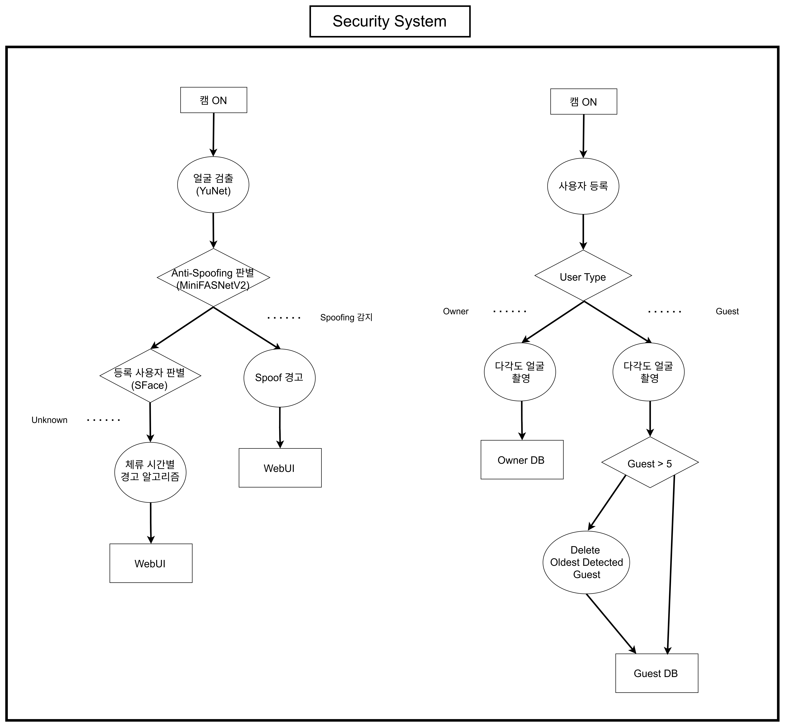

# 🔒 Security System — 차량 보안카메라 (Face Authentication & Anti-Spoofing)

차량 내부의 얼굴을 분석하여 **등록된 소유자(OWNER)**, **등록된 허용 사용자(GUEST)**, **미등록 사용자(UNKNOWN)**, **위조 얼굴(SPOOF)**을 구분하는 보안 카메라 시스템입니다. 얼굴 검출 → Anti-Spoofing 판별 → 얼굴 인식의 3-Stage Pipeline으로 구성하고, UNKNOWN/SPOOF 지속시간 기반 보안 정책으로 단순 얼굴 인식을 넘어선 이상 접근 판단까지 수행합니다.

> 온디바이스 시스템반도체설계 2기 팀 프로젝트 — Security System 담당: 이나경 (2026.08.05 ~ 2026.08.19)

## 📌 Overview

| 항목 | 내용 |
|---|---|
| 처리 흐름 | Webcam → YuNet(얼굴 검출) → MiniFASNetV2(Anti-Spoofing) → SFace(얼굴 인식) → 상태 판정 → Capture/Web Alarm |
| 분류 결과 | OWNER / GUEST / UNKNOWN / SPOOF |
| 실행 파일 | `security_exe.py` (Webcam/저장영상 공용, Web UI 서버 자동 실행) |
| 사용자 DB | SQLite (`face_database.sqlite3`), 사용자당 얼굴 임베딩 15개 수집 |
| Web UI | Flask 기반, 실행 시 자동 시작 (기본 포트 5000) |

## ✨ Features

- **3-Stage Pipeline**: YuNet(얼굴 검출 + Landmark) → MiniFASNetV2(Anti-Spoofing, LIVE/SPOOF 판별) → SFace(얼굴 Embedding 기반 등록자 비교) 순서로 실제 얼굴만 인증 단계까지 전달
- **경량 Anti-Spoofing 우선 적용**: 사진·스마트폰 화면 등 위조 입력을 사용자 인증보다 먼저 걸러내어, LIVE로 판정된 얼굴만 SFace 비교 수행 (MiniFASNetV2, 약 0.435M Parameters·0.081GFLOPs)
- **지속시간 기반 보안 정책**: UNKNOWN/SPOOF를 단일 Frame에서 즉시 경고하지 않고, Capture Timer(이벤트 저장)와 Presence Timer(전체 체류시간)를 분리 운영하여 순간적 오검출과 실제 장시간 비인가 접근을 구분
- **Web UI/Mobile 연동**: Jetson과 동일 네트워크의 스마트폰·PC 브라우저에서 실시간 보안 상태, UNKNOWN 지속시간, Capture/Alarm 이벤트, 이벤트 이미지를 확인 가능
- **보안 이벤트 자동 저장**: UNKNOWN/SPOOF 이벤트 발생 시 전체 Frame, 얼굴 Crop, 발생 시각·지속시간·이벤트 유형을 `security_events/`에 이미지 + `event.json`으로 기록
- **웹캠 기반 사용자 등록**: `register_person.py`로 OWNER/GUEST를 직접 등록, 등록 시에도 Anti-Spoofing을 거쳐 LIVE로 판정된 얼굴만 등록 데이터로 사용, 중복 등록 방지

## 🏗️ Architecture



### 처리 흐름

```
Webcam 입력
    ↓
YuNet — 얼굴 검출 (Bounding Box + Landmark)
    ↓
MiniFASNetV2 — Anti-Spoofing (LIVE / SPOOF, Threshold 0.60, 3초 연속 시 SPOOF 확정)
    ↓ (LIVE만 통과)
SFace — 얼굴 Embedding 추출 → 등록 DB 비교
    ↓
OWNER / GUEST / UNKNOWN 판정
    ↓
지속시간 기반 Security Policy → Capture / Web Alarm
```

### 기본 보안 정책

| 조건 | 시스템 동작 |
|---|---|
| UNKNOWN 10초 지속 | 전체 Frame 및 얼굴 Crop 저장(Capture) |
| Capture Cycle 20초 경과 | Capture Cycle Timer만 초기화 (Presence Timer는 유지) |
| UNKNOWN 30초 연속 지속 | Web Alarm 발생 |
| SPOOF 3초 연속 지속 | Capture + Web Alarm 즉시 발생 |
| OWNER/GUEST 등장 또는 UNKNOWN 소멸 | 관련 Timer 초기화 |

> 시연에서는 위 시간을 5초 Capture / 15초 Alarm / 20초 Capture Cycle Reset / SPOOF 3초로 단축해 사용합니다 (`--unknown-seconds`, `--unknown-alarm-seconds` 등 옵션).

## 📁 구성 파일

| 파일 | 설명 |
|---|---|
| `security_exe.py` | Webcam/저장영상 공용 통합 실행 파일 (Web UI 서버 자동 시작) |
| `face_detector.py` | YuNet 기반 얼굴 검출 |
| `anti_spoof.py` / `minifasnet.py` | MiniFASNetV2 기반 Anti-Spoofing |
| `face_recognizer.py` | SFace 기반 얼굴 인식 |
| `face_database.py` | SQLite 사용자 DB 관리 |
| `security_policy.py` | UNKNOWN/SPOOF 지속시간 기반 보안 정책 |
| `capture_manager.py` | 보안 이벤트 Capture 및 저장 |
| `register_person.py` / `registration.py` | OWNER/GUEST 웹캠 등록 |
| `manage_people.py` | 등록 사용자 목록 조회/관리 |
| `web_alarm.py` | Web UI/경고음 서버 |
| `verify_setup.py` | 실행 환경 및 모델 파일 점검 |
| `download_models.py` | 필요 모델 파일 다운로드 |
| `config.py` | 설정값 관리 |
| `models/face_detection_yunet_2023mar.onnx` | YuNet 얼굴 검출 모델 |
| `models/2.7_80x80_MiniFASNetV2.pth` | Anti-Spoofing 모델 |
| `static/alarm.wav` | 경고음 리소스 |
| `sim_video.mp4`, `시연영상(보안캠)_07.mp4` | 저장 영상 테스트/시연용 영상 |
| `실행방법_securitysystem.md` | 실행 환경 구성, 사용자 등록, Web UI 접속 가이드 |
| `THIRD_PARTY_NOTICES.md` | 사용된 오픈소스 모델/라이브러리 라이선스 고지 |

> `models/face_recognition_sface_2021dec.onnx`(약 38MB)는 용량 제한으로 제외했습니다. 실제 등록된 사용자 얼굴 임베딩이 담긴 `database/face_database.sqlite3`와 `security_events/` 내 캡처 이미지는 개인정보 보호를 위해 포함하지 않았습니다 (원본 `.gitignore` 정책과 동일).

## 🛠️ 설계 시 고려 사항

- 얼굴 검출만으로 인증하면 사진·화면 속 얼굴을 실제 사용자로 오인할 수 있어, Anti-Spoofing 단계를 얼굴 인식보다 먼저 배치하였습니다.
- UNKNOWN을 즉시 위험으로 판단하면 신규 OWNER/GUEST의 최초 접근이나 순간적인 인식 실패까지 보안 위험으로 오판할 수 있어, Capture Timer와 Presence Timer를 분리해 지속시간 기준으로만 경고가 발생하도록 구성하였습니다.
- 등록 과정에서도 Anti-Spoofing을 거치도록 하여, 위조 얼굴이 정식 사용자로 등록되는 것을 원천 차단하였습니다.

## ⚙️ Design Environment

- Language: Python
- Face Detection: YuNet (OpenCV ONNX)
- Anti-Spoofing: MiniFASNetV2
- Face Recognition: SFace (OpenCV ONNX)
- Database: SQLite
- Backend: Flask (Web UI)
- Deployment Target: NVIDIA Jetson Orin Nano (JetPack 6.2.2, CUDA 12.6)

실행 방법(모델 파일 배치, 사용자 등록, Web UI 접속 포함)은 [`실행방법_securitysystem.md`](./실행방법_securitysystem.md)를 참고하세요.
