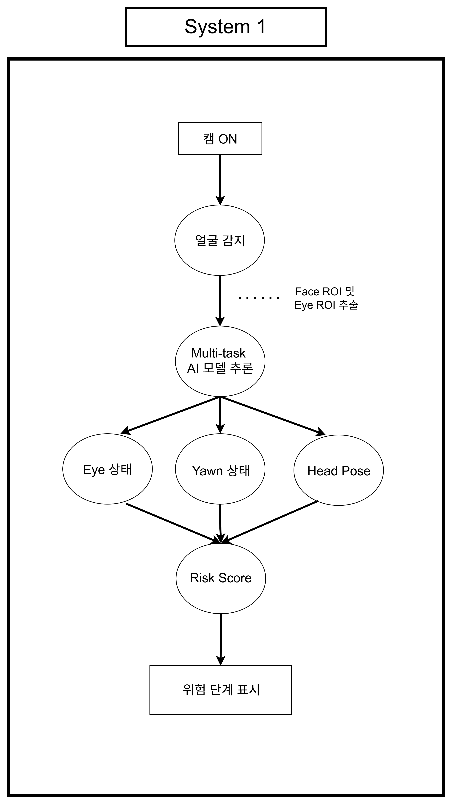
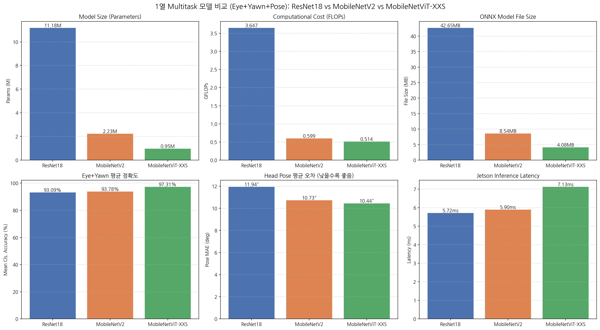
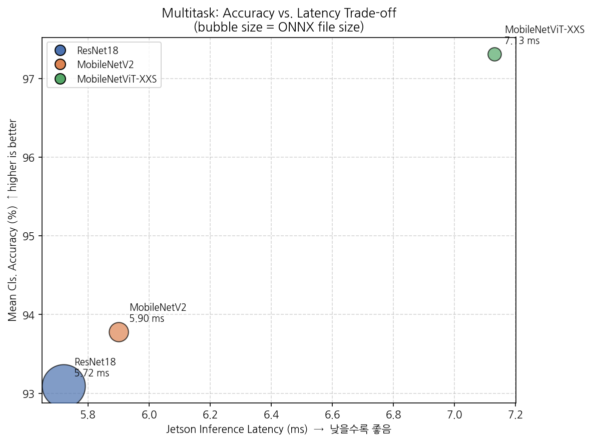
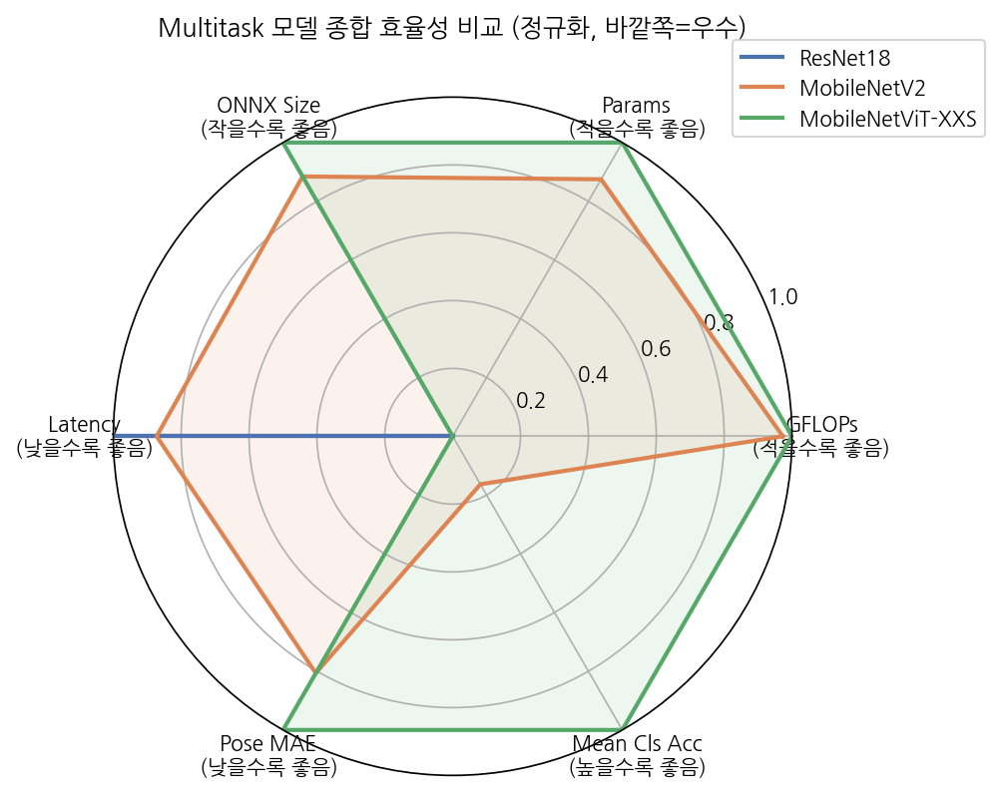
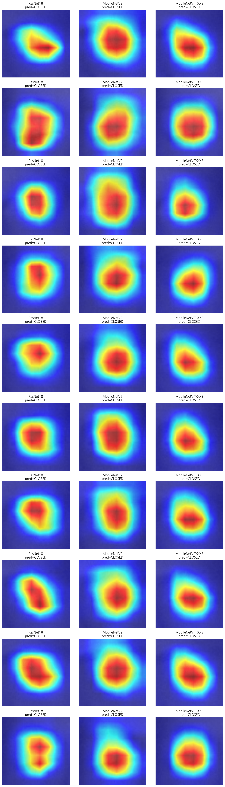
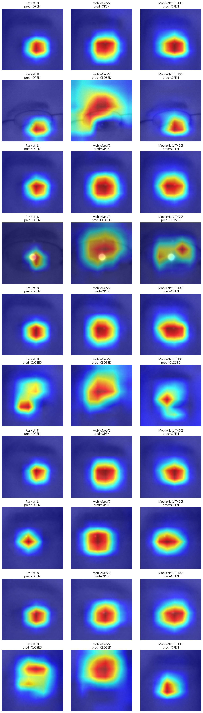

# 😴 System1 — 운전자 졸음 모니터링 (Multi-task Drowsiness Detection)

운전자의 눈 감김(Eye), 하품(Yawn), 고개 자세(Head Pose)를 하나의 Multi-task 모델로 동시에 추론하고, 단일 Frame이 아닌 시간에 따른 상태 변화를 누적하여 졸음 위험도(Risk Score)를 실시간으로 판단하는 시스템입니다. ResNet18 / MobileNetV2 / MobileViT-XXS 3종 Backbone을 직접 학습·비교하고, Jetson Orin Nano 실측 성능과 Grad-CAM 분석까지 거쳐 최종 모델을 선정하였습니다.

> 온디바이스 시스템반도체설계 2기 팀 프로젝트 — System1 담당: 최민영 (2026.08.05 ~ 2026.08.19)

## 📌 Overview

| 항목 | 내용 |
|---|---|
| 처리 흐름 | Webcam → 얼굴 검출(Eye/Face ROI) → Multi-task 추론 → Risk Score 누적 계산 → 상태 출력 |
| Task 구성 | Eye(OPEN/CLOSED), Yawn(NO_YAWN/YAWN), Head Pose(Pitch/Yaw/Roll 회귀) |
| Backbone 후보 | ResNet18, MobileNetV2, MobileViT-XXS (timm) |
| 최종 선정 모델 | **MobileViT-XXS** |
| 실행 파일 | `multitask_exe.py` (Webcam/저장영상 공용) |
| 최종 출력 | NORMAL / WARNING / DANGER (+ WARMUP) |

## ✨ Features

- **Shared Backbone + 3-Head Multi-task 구조**: 하나의 Backbone에서 추출한 특징을 Eye Head(2-class Linear), Yawn Head(2-class Linear), Pose Head(3축 회귀 + Tanh)로 분기
- **ROI 기반 입력 분리**: 좌우 Eye ROI는 하나의 배치로 묶어 눈 감김 판단에, Face ROI는 하품·고개 자세 판단에 별도로 사용 — 배경 정보를 제거하고 졸음 관련 특징에 추론을 집중
- **Partial-label Multi-task Learning**: Eye/Yawn/Head Pose 데이터셋마다 제공하는 라벨이 달라, Batch마다 해당 Task의 Loss만 계산하되 Shared Backbone은 항상 업데이트. 가장 작은 Yawn 데이터 기준으로 DataLoader Batch(112)를 통일해 특정 Task가 학습을 지배하지 않도록 설계
- **Sliding Window 기반 Risk Score**: 최근 3초 구간의 Eye Closed Ratio, 60초 구간의 Yawn Score, 3초 구간의 Head-down Ratio를 가중합하여 순간적인 눈 깜빡임·자세 변화로 인한 오경보 방지
- **자동 Head Pose Calibration**: 실행 직후 약 2초간 정면 자세의 Pitch 중앙값을 기준값(Baseline)으로 설정, 이후 상대적인 고개 숙임 정도를 판단
- **3종 Backbone 정량 비교 + Grad-CAM 정성 분석**: 수치 비교만으로 설명하기 어려운 정확도 차이를 Grad-CAM 시각화로 보완 검증

## 🏗️ Architecture



### Multi-task 모델 구조

```
                          ┌─────────────────┐
   Eye ROI (좌우) ------> │                 │ --> Eye Head   --> OPEN / CLOSED
                          │  Shared Backbone │
   Face ROI ------------> │  (ResNet18 /     │ --> Yawn Head  --> NO_YAWN / YAWN
                          │   MobileNetV2 /  │
                          │   MobileViT-XXS) │ --> Pose Head  --> Pitch / Yaw / Roll
                          └─────────────────┘
```

### 처리 흐름

```
Webcam 입력
    ↓
얼굴 검출 → Eye ROI(좌우) / Face ROI 생성
    ↓
Multi-task 모델 추론 (OPEN/CLOSED, YAWN/NO_YAWN, Pitch/Yaw/Roll)
    ↓
Sliding Window 누적 (Closed Ratio / Yawn Score / Head-down Ratio)
    ↓
Risk Score = 0.45×Closed Ratio + 0.25×Yawn Score + 0.30×Head-down Ratio
    ↓
NORMAL (<0.40) / WARNING (0.40~0.70) / DANGER (≥0.70)
```

## 📁 구성 파일

| 파일 | 설명 |
|---|---|
| `multitask_exe.py` | Webcam/저장영상 공용 실시간 추론 실행 파일 |
| `inference_time_on_jetson.py` | Jetson 환경에서의 모델별 추론 시간(Latency) 측정 스크립트 |
| `multitask_train.ipynb` | Multi-task 모델 학습 노트북 (Google Colab, Tesla T4) |
| `models/mobilevit_xxs_multitask_best.pth` / `.onnx` | 최종 선정 모델 (기본 시연 모델) |
| `models/mobilenetv2_multitask_best.pth` / `.onnx` | 비교 모델 (경량-정확도 균형) |
| `test_video.mp4`, `시연영상(졸음운전)_07.mp4` | 저장 영상 실행 테스트용/시연용 영상 |
| `실행방법_system1.md` | 실행 환경 구성 및 전체 옵션 가이드 |

> ResNet18 Multi-task 모델(`.pth`/`.onnx`, 각 약 43MB)은 용량 제한으로 저장소에서 제외했습니다. 필요 시 `multitask_train.ipynb`로 동일 조건에서 재학습할 수 있습니다.

## 🔍 모델 학습 및 성능 비교

### 학습 조건

| 항목 | 설정 |
|---|---|
| 입력 해상도 | 256×256 |
| Batch Size | 32 (Task별 DataLoader는 112로 통일) |
| Optimizer | AdamW (LR 1×10⁻⁴, Weight Decay 1×10⁻⁴) |
| Scheduler | CosineAnnealingLR |
| Early Stopping | 5 Epoch |
| 초기 가중치 | ImageNet Pretrained |
| 학습 장치 | Tesla T4 GPU (Google Colab) |
| 학습 데이터 | Eye 84,898장, Yawn 5,119장, Head Pose(300W-LP/AFLW2000-3D) |

### 단일 Task 사전 비교

| 모델 | Test Accuracy | Parameters | GFLOPs | ONNX 크기 | Jetson Latency | FPS |
|---|---|---|---|---|---|---|
| ResNet18 | 96.83% | 11.18M | 1.824 | 42.63MB | 3.89ms | 257.1 |
| MobileNetV2 | 95.24% | 2.23M | 0.326 | 8.47MB | 3.97ms | 251.9 |
| MobileViT-XXS | 93.12% | 0.95M | 0.257 | 3.82MB | 5.06ms | 197.6 |

단일 Task 기준으로는 ResNet18이 가장 높은 정확도와 속도를 보였고, MobileNetV2가 크기 대비 손실이 적어 가장 균형 잡힌 결과를 보였습니다.

### 최종 Multi-task 모델 비교



| 모델 | Eye Accuracy | Yawn Accuracy | Pose MAE | Parameters | ONNX 크기 | Jetson Latency |
|---|---|---|---|---|---|---|
| ResNet18 | 93.09% | - | 11.94° | 11.18M | 42.65MB | 5.72ms |
| MobileNetV2 | 93.78% | - | 10.73° | 2.23M | 8.54MB | 5.90ms |
| **MobileViT-XXS** | **97.31%** | - | **10.44°** | **0.95M** | **4.08MB** | 7.13ms |

단일 Task 비교와 달리 Multi-task 학습 결과에서는 가장 가벼운 MobileViT-XXS가 Eye Accuracy·Pose MAE 모두에서 가장 우수했습니다. Latency는 세 모델 중 가장 길었지만(7.13ms), 30FPS 영상의 Frame당 처리 제한시간(약 33.3ms)에 비하면 충분히 짧아 실시간 처리에는 문제가 없다고 판단하였습니다.




### Grad-CAM 기반 판단 근거 분석

Eye Task의 OPEN/CLOSED 판단 근거를 시각적으로 검증하기 위해 OPEN 10장, CLOSED 10장(총 20장)의 Eye ROI 샘플에 Grad-CAM을 적용하였습니다.

| 상태 | ResNet18 | MobileNetV2 | MobileViT-XXS |
|---|---|---|---|
| CLOSED | 10/10 | 10/10 | 10/10 |
| OPEN | 7/10 | 6/10 | 8/10 |

| CLOSED 샘플 Grad-CAM | OPEN 샘플 Grad-CAM |
|---|---|
|  |  |

CLOSED 샘플은 세 모델 모두 정확히 분류했으며, OPEN 샘플에서는 MobileViT-XXS가 8/10으로 가장 우수했습니다. Heatmap을 비교한 결과 MobileNetV2는 눈 전체와 주변 영역까지 넓게 활성화된 반면, MobileViT-XXS는 동공과 눈꺼풀 중심의 좁은 영역에 활성화가 집중되어, Eye 상태 판단과 직접 관련된 특징에 더 집중하는 경향을 확인하였습니다.

### 최종 모델 선정 근거

Eye/Yawn/Head Pose를 국소적이고 명확한 신호(눈을 떴는지/감았는지, 하품 여부)로 판단하는 이 Task 특성상, 파라미터 수가 많다고 반드시 유리하지 않으며 MobileViT-XXS의 Attention 메커니즘이 오히려 이런 국소 패턴 포착에 유리했을 가능성으로 분석하였습니다. 졸음 판단의 핵심 지표인 Eye Accuracy, 가장 작은 모델 크기(Jetson 통합 시스템에서 여러 모델을 동시 실행해야 하는 메모리 제약), Grad-CAM으로 확인한 판단 근거의 타당성을 종합하여 **MobileViT-XXS**를 System1의 최종 모델로 선정하였습니다.

## 🛠️ Trouble Shooting

| 문제 | 원인 | 해결 |
|---|---|---|
| 초기 전체 영상 기반 졸음 분류 시 학습-실행 환경 간 배경/조명 차이로 예측이 불안정 | 전체 Frame을 입력하면 배경·조명 등 졸음 판단과 무관한 특징까지 함께 학습되어, 촬영 환경이 바뀌면 예측이 흔들림 | 졸음 여부를 하나의 Class로 직접 분류하지 않고 Eye/Yawn/Head Pose 3개 Task로 분리, 얼굴 검출 기반 Eye ROI/Face ROI만 입력하도록 구조 변경. 이를 통해 배경 영향을 제거하고 각 Task 결과를 시간축으로 누적해 Risk Score를 계산하는 구조로 확장 |
| 단일 Task 평가와 Multi-task 평가에서 모델 순위가 정반대로 나타남 | 단일 Task에서는 ResNet18이 최고, MobileViT-XXS가 최저였으나, 세 Task를 함께 학습한 Multi-task 결과에서는 MobileViT-XXS가 최고 성능을 기록. 두 학습 구조와 데이터 구성이 달라 직접 비교가 어려움 | 최종 시스템에서 실제 사용하는 Multi-task 결과를 모델 선정의 우선 기준으로 설정하고, 정량 수치만으로 원인을 단정하지 않기 위해 Grad-CAM으로 각 모델의 판단 근거(Eye ROI 내 집중 영역)를 추가 검증 |
| 이론적으로 가장 경량인 MobileViT-XXS의 실제 Jetson Latency가 가장 길게 측정됨 | ResNet18/MobileNetV2는 Convolution 중심 구조로 TensorRT 최적화 Kernel을 효과적으로 활용할 수 있는 반면, MobileViT-XXS의 Transformer/Attention 연산은 동일 수준의 최적화 효과를 얻지 못해 이론적 연산량 대비 실제 실행시간이 증가 | GFLOPs만으로 실행 속도를 판단하지 않고 실제 Jetson Latency/FPS를 최종 평가 항목에 포함. MobileViT-XXS의 7.13ms가 30FPS 영상 처리 요구조건(약 33.3ms)을 충분히 만족하는지 확인 후 채택 |

## 👥 Team & Role

| 담당 | 역할 |
|---|---|
| 최민영 | System1 데이터셋 구축, ResNet18·MobileNetV2·MobileViT-XXS 학습 및 정량 성능(정확도·모델크기·연산량·Jetson Latency) 비교, Grad-CAM 기반 판단 근거 분석, System1 최종보고서·발표자료 작성 |
| 이나경 | System1 3종 모델 데이터셋 학습, System1 시연영상 제작 |

## ⚙️ Design Environment

- Language: Python
- AI Framework: PyTorch, timm
- Model Training: Google Colab (Tesla T4 GPU)
- Inference Optimization: PyTorch CUDA / ONNX
- Deployment Target: NVIDIA Jetson Orin Nano (JetPack 6.2.2, CUDA 12.6)

실행 방법은 [`실행방법_system1.md`](./실행방법_system1.md)를 참고하세요.
