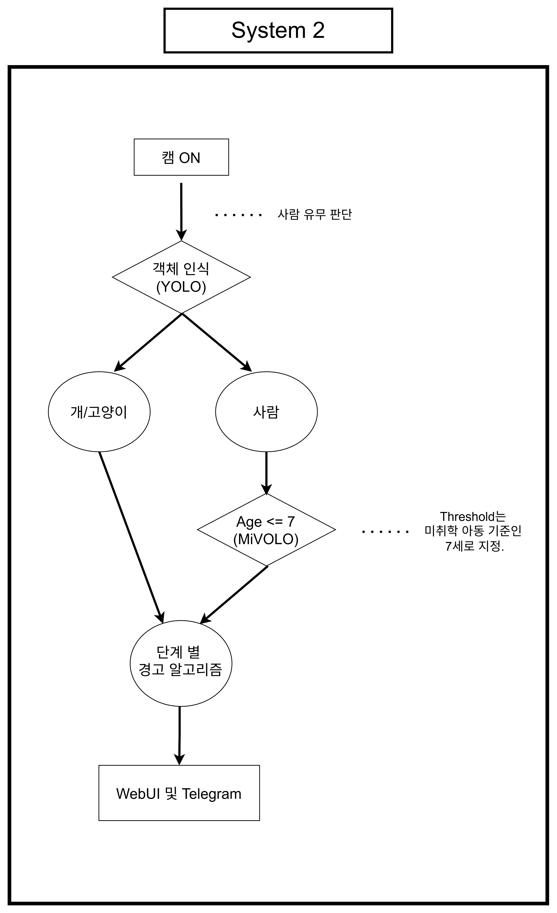

# 👶 System2 — 차량 내 잔류 탑승자 감지 (Residual Occupant Detection)

차량 뒷좌석을 실시간으로 모니터링하여 7세 이하 아동과 반려동물(dog/cat)의 잔류 여부를 판단하고, 차량 시동이 꺼진 상태에서 위험 대상이 일정 시간 이상 남아있을 경우 단계별로 경고하는 시스템입니다. YOLO11 객체 검출과 MiVOLO V2 연령 추정을 결합한 2-Stage Pipeline으로 구성하였습니다.

> 온디바이스 시스템반도체설계 2기 팀 프로젝트 — System2 담당: 이찬미, 이나경 (2026.08.05 ~ 2026.08.19)

## 📌 Overview

| 항목 | 내용 |
|---|---|
| 처리 흐름 | Webcam → YOLO11(Person/Cat/Dog 검출) → Person Tracking → MiVOLO V2(연령 추정) → CHILD/ANIMAL 판정 → Stage 판단 → Alert Server |
| 객체 검출 후보 | YOLO11n / YOLO11s / YOLO11m |
| 최종 선정 모델 | Fine-tuned **YOLO11n** + MiVOLO V2 |
| 실행 파일 | `yolo_mivolov2_exe.py` (Webcam/저장영상 공용) |
| 잔류 감지 대상 | CHILD(7세 이하 추정), ANIMAL(dog/cat) |
| 최종 출력 | Stage 0(정상) → Stage 1(저소음 경고) → Stage 2(보호자 Telegram 알림) → Stage 3(에어컨 동작 표시) |

## ✨ Features

- **YOLO11 + MiVOLO V2 2-Stage Pipeline**: YOLO가 Person/Cat/Dog를 검출하고, Person이 검출된 경우에만 MiVOLO V2로 연령을 추정해 불필요한 연산을 줄이는 구조
- **IoU 기반 Person Tracking + Round-robin 연령 추정**: 다중 인원 검출 시 매 Frame마다 모든 인원을 추론하지 않고 약 1초 간격으로 한 명씩 순차적으로 나이를 갱신, 최근 5회 추정값의 Median으로 결과를 안정화
- **차량 시동 상태 연동 잔류 타이머**: 시동 OFF + CHILD/ANIMAL 검출 시에만 잔류 타이머 시작, 시동 ON이나 대상 소실 시 즉시 Stage 0으로 초기화
- **단계별 경고(Stage 1~3)**: 잔류 지속시간에 따라 저소음 경고 → Telegram 보호자 알림 → 에어컨 동작 표시로 경고 강도를 단계적으로 상승 (실제 적용 기준 5분/10분/20분, 시연용 10초/15초/20초로 단축)
- **Alert Server / Web UI / Telegram 연동**: Jetson 내부에서 추론과 위험 판단을 완료하고, 영상이 아닌 최종 상태·잔류 정보만 외부로 전달해 영상 데이터 외부 전송을 최소화
- **YOLO11n Fine-tuning으로 Young/Animal Recall 개선**: 초기 YOLO11n의 Person 미검출 문제를 상반신·다양한 구도의 데이터 추가 학습으로 해결

## 🏗️ Architecture



### 처리 흐름

```
Webcam 입력
    ↓
YOLO11n (Fine-tuned) — Person / Cat / Dog 검출 (2 Frame마다 1회 추론)
    ↓
Person → IoU 기반 Tracking (ID 부여, 최대 5명)
    ↓
MiVOLO V2 — Round-robin 방식 연령 추정 (약 1초 간격, 최근 5회 Median)
    ↓
Age ≤ 7 → CHILD   /   Age > 7 → ADULT   /   Cat·Dog → ANIMAL
    ↓
차량 시동 상태 + 잔류 지속시간 판단
    ↓
Stage 0(정상) → Stage 1(저소음경고, 5분) → Stage 2(Telegram 알림, 10분) → Stage 3(에어컨 표시, 20분)
    ↓
Alert Server (FastAPI) → Web UI (WebSocket) / Telegram Bot
```

### 실행 구조

Jetson Orin Nano에서 두 모델을 동시에 실시간 실행하기 위해 YOLO는 **TensorRT Engine**, MiVOLO V2는 **TorchScript 기반 GPU(CUDA/FP16)** 환경으로 구성하여 모두 GPU에서 처리하도록 통일하였습니다 (초기에는 MiVOLO V2가 ONNX CPU Provider로 실행되어 지연이 발생했던 것을 GPU 실행으로 전환).

## 📁 구성 파일

| 파일 | 설명 |
|---|---|
| `yolo_mivolov2_exe.py` | Webcam/저장영상 공용 실시간 검출·연령추정·경고 실행 파일 |
| `alert_server.py` | FastAPI 기반 Alert Server (Web UI/Telegram 연동) |
| `alert_client.py` | 검출 프로그램 → Alert Server 전송 클라이언트 |
| `dashboard.html` | WebSocket 기반 실시간 상태 대시보드 |
| `inference_time.py` | YOLO11n/s/m 및 Pipeline 추론 시간·전력 측정 스크립트 |
| `YOLO11n_Finetuned.ipynb` | YOLO11n Fine-tuning 학습 노트북 |
| `MiVOLOV2_torchscript_convert.ipynb` | MiVOLO V2 TorchScript 변환 노트북 |
| `models/yolo11n.pt` / `.onnx` | YOLO11n 기본 모델 |
| `models/YOLO11n_Finetuned.pt` / `.onnx` | Fine-tuning 후 최종 선정 모델 |
| `models/mivolo_v2.onnx` | MiVOLO V2 연령 추정 모델 (ONNX) |
| `test_video.mp4`, `sim_video.mp4` | 저장 영상 테스트/시연용 영상 |
| `실행방법_system2.md` | 실행 환경 구성, Telegram Bot 등록, 전체 옵션 가이드 |

> YOLO11s/m 계열 가중치, MiVOLO V2 `.pt`(약 111MB)와 TensorRT `.engine` 파일은 용량 제한 및 하드웨어 종속성(Jetson 보드·TensorRT 버전에 종속되어 재사용 불가) 때문에 제외했습니다. 시연 시연영상(`시연영상(잔류탑승자)_07.mp4`, 약 31MB)도 동일한 이유로 제외했습니다.

## 🔍 모델 성능 비교 및 분석

### YOLO11n/s/m 정량 성능 비교

| 평가항목 | YOLO11n | YOLO11s | YOLO11m |
|---|---|---|---|
| Final Accuracy | 79.15% | **81.99%** | 79.62% |
| **Young Recall** | **75.31%** | 71.60% | 67.90% |
| Animal Recall | 86.67% | 95.00% | 95.00% |
| E2E Latency | **886.82ms** | 895.36ms | 958.56ms |
| FPS | 1.139 | 1.133 | 1.076 |
| Parameters | **2.6M** | 9.4M | 20.1M |
| FLOPs | **6.5B** | 21.5B | 68.0B |

전체 정확도는 YOLO11s가 가장 높았지만, 잔류 탑승자 시스템에서는 실제 7세 이하 아동을 놓치지 않는 것이 최우선이므로 **Young Recall**을 핵심 선정 지표로 적용하였습니다. YOLO11n이 Young Recall 75.31%로 가장 높고, 파라미터/연산량/Latency도 가장 낮아 Fine-tuning의 Base Model로 선정하였습니다.

### YOLO11n Fine-tuning 전후 비교

Person 상반신/전신 다양한 구도와 Cat/Dog 데이터를 추가해 앞단 10개 Layer를 Freeze한 채 10 Epoch Fine-tuning을 수행하였습니다.

| 평가지표 | Fine-tuning 전 | Fine-tuning 후 | 변화 |
|---|---|---|---|
| Precision | 61.30% | 88.28% | +26.98%p |
| Recall | 50.20% | 83.59% | +33.39%p |
| F1-score | 55.20% | 85.87% | +30.67%p |
| mAP50 | 51.00% | 90.44% | +39.44%p |
| mAP50-95 | 35.64% | 59.77% | +24.13%p |

### Fine-tuning 후 최종 Pipeline 성능 (Unified Evaluation, 211장)

| 평가지표 | Fine-tuning 전 | Fine-tuning 후 | 변화 |
|---|---|---|---|
| Final Accuracy | 79.15% | 95.26% | +16.11%p |
| **Young Recall** | 75.31% | **93.83%** | +18.52%p |
| Animal Recall | 86.67% | 96.67% | +10.00%p |
| Person Detection Rate | 78.81% | 99.34% | +20.53%p |
| Age MAE | 2.29 year | 1.93 year | -0.36 year |

Confusion Matrix 기준으로 기존 YOLO11n에서 발생하던 Young(아동) Person 미검출 17건이 Fine-tuning 후 0건으로 감소하였습니다. 다만 Fine-tuning 후에도 Young 81건 중 5건은 Person 검출 자체는 되었으나 MiVOLO 연령 추정 단계에서 ADULT로 오분류된 경우로, 객체 검출 문제와 별개로 연령 추정 모델의 안정성은 추가 개선 여지가 있음을 확인하였습니다.

## 🛠️ Trouble Shooting

| 문제 | 원인 | 해결 |
|---|---|---|
| 다중 인원 검출 시 영상 지연 발생 | YOLO11에서 검출된 모든 Person에 대해 MiVOLO V2가 연령을 순차 추정하여, 화면 내 인원이 늘어날수록 Frame당 처리시간이 증가 | YOLO 모델을 PyTorch에서 TensorRT FP16 Engine으로 변환하고, 연령 추정은 모든 인원을 동시 처리하지 않고 한 명씩 순차 갱신하는 Round-robin 방식 적용, 추정 주기·최대 추적 인원수 제한 |
| YOLO11n Person Young(아동) 미검출 17건 발생 | 2-stage 구조에서 YOLO 단계의 Bounding Box 생성 실패가 후단 MiVOLO 실행 자체를 막아, 검출 누락이 최종 Young Miss로 그대로 이어짐. 상반신/얼굴 중심 구도에서 집중 발생 | Person 전신뿐 아니라 상반신 중심의 다양한 구도와 Cat/Dog 데이터를 추가해 YOLO11n Fine-tuning (10 Layer Freeze, LR 0.0005, 10 Epoch) 수행 → Young Miss 17건→0건, Young Recall 75.31%→93.83% |
| YOLO11n/s/m 단발 전력 측정에서 YOLO11s가 YOLO11m보다 높게 측정되는 비정상 경향 | 측정 횟수가 1회에 불과해 GPU Clock 변화, Background Process, 순간적인 전력 변동이 결과에 반영됨 | 모델당 30초씩 3회 반복 실행 + 실행 사이 5초 대기시간을 Shell Script로 자동화, 평균·표준편차 계산으로 재현성 확보 → `YOLO11n < YOLO11s < YOLO11m` 정상 경향 확인 (다만 차이는 약 67mW로 미미) |
| MiVOLO V2 CPU 실행으로 인한 실제 시스템과의 측정 조건 불일치 | 전력 측정 시 MiVOLO V2가 ONNX CPU Provider로 실행되어, 최종 시스템(TorchScript·CUDA·FP16 GPU 실행)과 조건이 달랐음 | MiVOLO V2를 TorchScript 기반 GPU(CUDA/FP16) 실행으로 변경 후 YOLO11n/s/m을 동일 조건에서 재측정 |
| YOLO 전력 측정 시 영상 종료 후에도 프로그램이 종료되지 않아 무한 대기 상태의 전력값이 계속 저장됨 | 영상 Frame Read 실패 이후에도 반복문이 종료되지 않는 것이 원인 | 영상 종료 조건에서 실행 Loop와 전력 측정을 함께 종료하도록 처리, 유효 추론 구간만 비교 자료에 반영 |

## 👥 Team & Role

| 담당 | 역할 |
|---|---|
| 이찬미 | YOLO11n/s/m 정확도 평가 환경 구축, Precision·Recall·F1-score·mAP50·mAP50-95·Young/Animal Recall 분석, 최종 모델 선정 및 YOLO11n Fine-tuning, System2 시연영상 및 보고서·발표자료 작성 |
| 이나경 | System2 실행 구조 및 MiVOLO GPU 환경 구축, YOLO11n/s/m + MiVOLO Pipeline E2E Latency·FPS 분석 |
| 최민영 | YOLO11n/s/m Jetson 전력 소비(Average Power, Energy/Frame) 측정 및 분석 |

## ⚙️ Design Environment

- Language: Python
- Object Detection: YOLO11 (Ultralytics)
- Age Estimation: MiVOLO V2
- Inference Optimization: TensorRT FP16 (YOLO), TorchScript CUDA (MiVOLO)
- Backend: FastAPI (Alert Server), WebSocket (Dashboard)
- Alert Channel: Telegram Bot API
- Deployment Target: NVIDIA Jetson Orin Nano (JetPack 6.2.2, CUDA 12.6)

실행 방법(가상환경 구성, Telegram Bot Token 발급, Alert Server 연동 포함)은 [`실행방법_system2.md`](./실행방법_system2.md)를 참고하세요.
